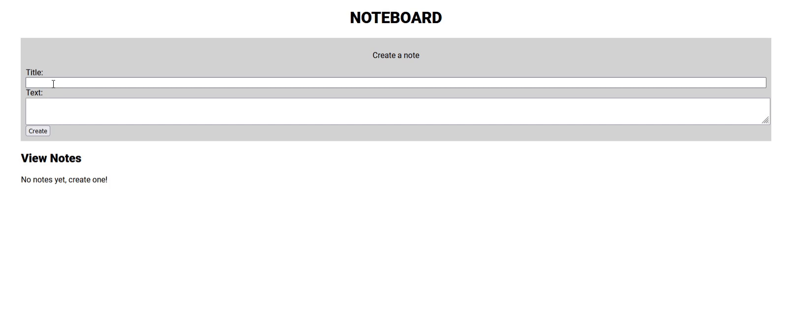

# noteboard - create and delete notes

# Set up
**You will need to set up a MySQL database first, enter the details in /config/db.js. Then copy paste the contents of setupdb.sql into the MySQL workbench connection and run to setup the table**

    # Install dependencies
    npm install
    
    # Start server
    npm start
    
 # How to use
 
 
 
 Head to http://localhost:5000 and fill out the form to add a note.
 
 Notes can be edited, deleted and moved around in the grid layout.
 

 
